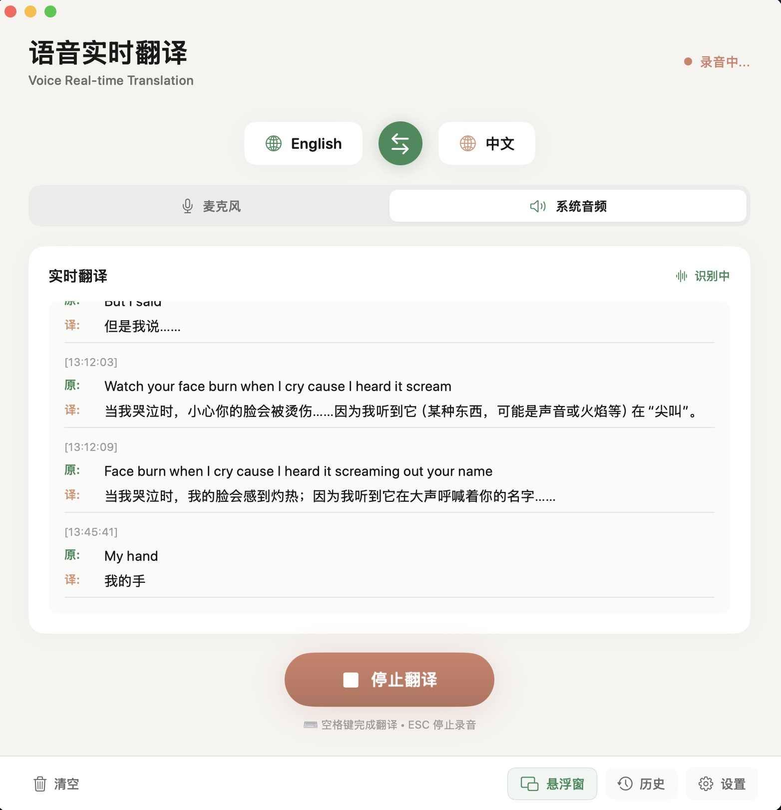

# VRT Landing Page

> Voice Real-time Translation（VRT）产品落地页。

**在线地址：** https://vrt.junxinzhang.com



---

## 简介

本目录包含 VRT 的静态落地页资源（HTML/CSS/JS），用于产品展示与转化引导。

## 主要内容

- 实时、低延迟、macOS 原生体验价值主张
- 功能清单、场景说明、FAQ
- 真实截图与演示视频（已替换占位）

## 媒体素材（已更新）

- 截图 1：`assets/vrt-1.jpg`
- 截图 2：`assets/vrt-2.jpg`
- 演示视频（B站）：https://www.bilibili.com/video/BV1LyA2zSEnZ
- 安装包：`downloads/VoiceTranslation.dmg`

## 本地预览

```bash
cd vrt-landing-page
python3 -m http.server 8080
```

打开：`http://localhost:8080`

## 部署

可直接部署到 GitHub Pages/Netlify/Vercel 等静态托管。

### 自定义域名

`CNAME` 已配置：`vrt.junxinzhang.com`

---

# VRT Landing Page (English)

> Product marketing and conversion landing page for Voice Real-time Translation.

**Live Site:** https://vrt.junxinzhang.com

## Overview

This folder contains static assets for the VRT landing page.

## Updated Media

- Screenshot 1: `assets/vrt-1.jpg`
- Screenshot 2: `assets/vrt-2.jpg`
- Demo video (Bilibili): https://www.bilibili.com/video/BV1LyA2zSEnZ
- macOS installer: `downloads/VoiceTranslation.dmg`

## Stack

- HTML5 / CSS3 / JavaScript

## Local Preview

```bash
cd vrt-landing-page
python3 -m http.server 8080
```
